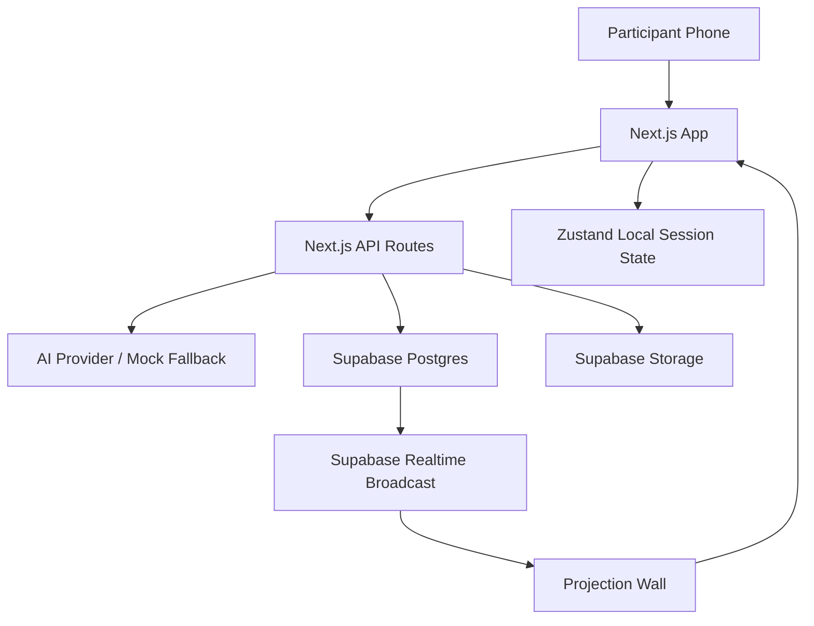

# Self · Distill

Self · Distill is an interactive web installation about AI, expression, benchmarking, automation, and the quiet transfer of agency from humans to systems.

Participants enter a fictional "Expression Optimization Service" on their phone. The system collects a photo and expression data, distills the participant's writing with AI, evaluates the human with a reverse benchmark, assigns a verdict, then routes them into a production game or a leisure loop. A projection wall displays the system state in real time.

This repository contains the Next.js web application, local Supabase schema, Realtime wall sync, AI provider abstraction, and development/production setup notes.

## Table Of Contents

- [Concept](#concept)
- [Current Features](#current-features)
- [Experience Flow](#experience-flow)
- [Tech Stack](#tech-stack)
- [Architecture](#architecture)
- [Getting Started](#getting-started)
- [AI Agent Quickstart](#ai-agent-quickstart)
- [Supabase Local Development](#supabase-local-development)
- [AI Configuration](#ai-configuration)
- [Testing](#testing)
- [Production Deployment](#production-deployment)
- [Project Structure](#project-structure)
- [Roadmap](#roadmap)

## Concept

The project reverses the familiar benchmark relationship between humans and AI. Instead of asking whether AI is good enough to imitate humans, the system asks whether humans are efficient, clear, compliant, and stable enough to remain useful to the system.

The installation follows several themes from the project plan:

- **Human Benchmark**: AI evaluates human expression through clarity, efficiency, emotional noise, and compliance.
- **Knowledge Distillation**: messy human expression is compressed into a cleaner, more system-friendly version.
- **Manufactured Consent**: participants enter through a normal-looking registration and terms flow.
- **Production And Automation**: high-performing or distilled participants move into an efficiency game where AI operation is often more stable than human input.
- **Leisure As Control**: low-output or reassigned participants enter a softer reward loop that still extracts behavioral data.
- **Projection Wall**: a shared display reveals the larger system: builders, participants, leaderboard, status, and system drift.

## Current Features

Implemented:

- Next.js App Router application.
- Terminal-style participant UI.
- Photo capture with `getUserMedia`.
- Terms flow and participant registration.
- Calibration questions.
- Expression writing task with typing metrics.
- AI distillation endpoint with streaming support and mock fallback.
- Human benchmark endpoint with structured scoring and mock fallback.
- Verdict page.
- Production/mining interaction.
- Leisure mode with gambling loop and backend reveal.
- Projection wall page.
- Supabase local schema and migrations.
- Participant persistence in Supabase when configured.
- Supabase Storage photo upload when configured.
- Supabase Realtime Broadcast updates for the projection wall.
- In-memory fallback when Supabase variables are not configured.
- Local development and production deployment flow documentation.

Not fully implemented yet:

- Anonymous Supabase Auth session binding per participant.
- Operator action UI and real target effects.
- Full Three.js particle wall.
- Programmatic avatar generation.
- Post-experience email/SMS messaging.
- AI queueing and production concurrency limits.

## Experience Flow

Main participant route sequence:

1. `/` - entry, terms, camera registration, participant creation.
2. `/calibrate` - disguised calibration questions.
3. `/task` - open expression prompt and typing behavior tracking.
4. `/distill` - AI distills the original text.
5. `/benchmark` - participant rates AI; AI rates participant.
6. `/verdict` - system classifies participant as `DISTILLED` or `VESSEL_PRESERVED`.
7. `/mine` - production/mining system.
8. `/leisure` - reward loop and backend reveal.
9. `/wall` - projection wall for the installation display.

API routes:

- `POST /api/participants` - create/update participant and upload photo.
- `GET /api/participants` - list wall participants.
- `POST /api/distill` - distill user expression.
- `POST /api/benchmark` - score human expression.

## Tech Stack

- **Framework**: Next.js 16 App Router
- **UI**: React 19, Tailwind CSS 4
- **State**: Zustand
- **Database**: Supabase Postgres
- **Storage**: Supabase Storage
- **Realtime**: Supabase Realtime Broadcast
- **AI Layer**: Provider abstraction for OpenAI-compatible APIs and Anthropic-style APIs
- **Local Infra**: Docker Desktop + Supabase CLI
- **Target Hosting**: Vercel + Supabase Cloud

## Architecture



Runtime modes:

- **Fallback mode**: no Supabase environment variables. The app still runs, and `/api/participants` uses in-memory state.
- **Supabase mode**: Supabase variables are present. Participants persist in Postgres, photos upload to Storage, and `/wall` receives Realtime Broadcast updates.

## Getting Started

### What You Need To Download

If you do not have a development environment yet, install these first.

#### 1. Node.js

Download Node.js from:

```text
https://nodejs.org/
```

Choose:

- **Windows**: download the Windows Installer `.msi`, preferably the **LTS** version.
- **macOS Apple Silicon**: choose the macOS installer for Apple Silicon if your Mac uses M1/M2/M3/M4.
- **macOS Intel**: choose the macOS installer for Intel if your Mac is older Intel hardware.
- **Linux**: use your distribution package manager or the Node.js installer instructions.

After installing, open a new terminal and check:

```bash
node --version
npm --version
```

Expected result: both commands print version numbers.

#### 2. Git

Download Git from:

```text
https://git-scm.com/downloads
```

Choose the installer for your operating system.

After installing, open a new terminal and check:

```bash
git --version
```

Expected result: Git prints a version number.

#### 3. Docker Desktop

Docker is required for local Supabase development.

Download Docker Desktop from:

```text
https://www.docker.com/products/docker-desktop/
```

Choose:

- **Windows**: **Download for Windows - AMD64** for most normal Windows laptops/desktops.
- **Windows ARM devices**: choose **Download for Windows - ARM64** only if your computer uses an ARM chip, for example some Snapdragon/Surface devices.
- **Mac Apple Silicon**: choose **Download for Mac - Apple Silicon** for M1/M2/M3/M4 Macs.
- **Mac Intel**: choose **Download for Mac - Intel Chip** for older Intel Macs.
- **Linux**: choose the Linux instructions for your distribution.

During Docker Desktop installation on Windows:

- Keep **Use WSL 2 instead of Hyper-V** checked.
- Leave **Allow Windows Containers** unchecked.
- Desktop shortcut is optional.

After installing Docker Desktop:

1. Start Docker Desktop.
2. Wait until it says Docker is running.
3. Open a new terminal and check:

```bash
docker --version
docker ps
```

Expected result: `docker --version` prints a version, and `docker ps` shows an empty table or running containers.

#### 4. Code Editor

Recommended:

```text
https://code.visualstudio.com/
```

Install **Visual Studio Code** if you want a graphical editor. This is not strictly required to run the project, but it is recommended.

### Download This Project

If you use Git:

```bash
git clone https://github.com/alonzo-f/self_distill_web.git
cd self_distill_web
```

If you downloaded a ZIP from GitHub:

1. Click **Code** on GitHub.
2. Click **Download ZIP**.
3. Unzip it.
4. Open a terminal inside the extracted `self_distill_web` folder.

### Install Project Dependencies

Install dependencies:

```bash
npm install
```

This downloads the JavaScript packages listed in `package.json`.

### Run Without Supabase

This is the simplest mode. It starts the UI, but participant data is temporary and disappears when the server restarts.

```bash
npm run dev
```

Open:

```text
http://localhost:3000
```

This fallback mode is useful for UI work, but participant data is not persistent.

## AI Agent Quickstart

This section is written for an AI coding agent or automation assistant. If a user asks an AI to set up and run this project, the agent should follow these steps in order.

### Goal

Start the app locally with Supabase enabled, verify participant persistence, verify Storage upload, and verify that the project builds.

### Rules For AI Agents

- Do not commit `.env.local`.
- Do not commit `node_modules/`, `.next/`, Supabase runtime folders, or dev logs.
- Prefer Supabase local mode when Docker is available.
- If Docker or Supabase cannot run, fall back to `npm run dev` and clearly report that persistence/realtime were not tested.
- After any code change, run `npm run lint`, `npx tsc --noEmit --incremental false`, and `npm run build`.

### Automated Setup Checklist

Run from the repository root:

```bash
node --version
npm --version
git --version
docker --version
docker ps
```

If Node/npm are missing, tell the user to install Node.js LTS from `https://nodejs.org/`.

If Docker is missing or not running, tell the user to install/start Docker Desktop from `https://www.docker.com/products/docker-desktop/`.

Install dependencies:

```bash
npm install
```

Start Supabase:

```bash
npm run supabase:start
```

Get local Supabase keys:

```bash
npx supabase status
```

Create `.env.local` using the local values from `npx supabase status`.

Expected `.env.local` shape:

```env
NEXT_PUBLIC_SUPABASE_URL=http://127.0.0.1:54321
NEXT_PUBLIC_SUPABASE_ANON_KEY=<Publishable key from supabase status>
SUPABASE_SERVICE_ROLE_KEY=<Secret key from supabase status>

AI_PROVIDER=openai
AI_MODEL=gpt-4o-mini
AI_API_KEY=
AI_BASE_URL=

RESEND_API_KEY=
TWILIO_ACCOUNT_SID=
TWILIO_AUTH_TOKEN=
CRON_SECRET=
```

Apply migrations:

```bash
npm run supabase:reset
```

If this command times out during Storage health checks on Windows, run:

```bash
npx supabase status
```

If Supabase reports that the local setup is running, continue.

Start the app:

```bash
npm run dev:local
```

Verify app routes:

```bash
curl http://localhost:3000
curl http://localhost:3000/wall
```

Verify participant API:

```bash
curl -X POST http://localhost:3000/api/participants \
  -H "Content-Type: application/json" \
  -d "{\"id\":\"00000000-0000-4000-8000-000000000001\",\"displayId\":\"HUMAN_TEST\",\"status\":\"UNPROCESSED\",\"output\":0,\"isOperator\":false}"

curl http://localhost:3000/api/participants
```

Run final checks:

```bash
npm run lint
npx tsc --noEmit --incremental false
npm run build
```

### Windows PowerShell Equivalent

PowerShell users can create `.env.local` like this after reading values from `npx supabase status`:

```powershell
Copy-Item .env.example .env.local
notepad .env.local
```

PowerShell participant API test:

```powershell
$body = @{
  id = "00000000-0000-4000-8000-000000000001"
  displayId = "HUMAN_TEST"
  status = "UNPROCESSED"
  output = 0
  isOperator = $false
} | ConvertTo-Json

Invoke-RestMethod -Uri http://localhost:3000/api/participants -Method Post -ContentType "application/json" -Body $body
Invoke-RestMethod -Uri http://localhost:3000/api/participants -Method Get
```

### Expected Success Criteria

The setup is successful when:

- `http://localhost:3000` returns the participant entry UI.
- `http://localhost:3000/wall` returns the projection wall.
- `POST /api/participants` returns `{ "ok": true }`.
- `GET /api/participants` returns the created participant.
- `npm run lint` passes.
- `npx tsc --noEmit --incremental false` passes.
- `npm run build` passes.

## Supabase Local Development

Use this mode when you want real local database, photo storage, and wall realtime updates.

Before starting:

1. Make sure Docker Desktop is open.
2. Wait until Docker Desktop says it is running.
3. Open a terminal in the project folder.

Start Supabase locally:

```bash
npm run supabase:start
```

The first run can take several minutes because Docker downloads Supabase images. This is normal.

The local stack prints values similar to:

```text
Project URL: http://127.0.0.1:54321
Publishable key: ...
Secret key: ...
Studio: http://127.0.0.1:54323
```

Create `.env.local` from `.env.example`:

```bash
cp .env.example .env.local
```

On Windows PowerShell:

```powershell
Copy-Item .env.example .env.local
```

Open `.env.local` in your editor and fill in these three values from the output printed by `npm run supabase:start`:

```env
NEXT_PUBLIC_SUPABASE_URL=http://127.0.0.1:54321
NEXT_PUBLIC_SUPABASE_ANON_KEY=<local publishable key>
SUPABASE_SERVICE_ROLE_KEY=<local secret key>
```

For this project:

- `NEXT_PUBLIC_SUPABASE_URL` should usually be `http://127.0.0.1:54321`.
- `NEXT_PUBLIC_SUPABASE_ANON_KEY` should use the **Publishable** key from Supabase status.
- `SUPABASE_SERVICE_ROLE_KEY` should use the **Secret** key from Supabase status.

Do not commit `.env.local` to GitHub. It is ignored by `.gitignore`.

Apply migrations:

```bash
npm run supabase:reset
```

This creates the database tables, storage bucket, row-level security policies, and realtime trigger used by the app.

Run the app:

```bash
npm run dev:local
```

Open:

```text
http://localhost:3000
```

Open Supabase Studio:

```text
http://127.0.0.1:54323
```

Supabase Studio is a local web dashboard where you can inspect:

- `participants` table
- `participant-photos` storage bucket
- database rows created by the app

Useful local checks:

```bash
npm run lint
npx tsc --noEmit --incremental false
npm run build
```

### Local Supabase Notes On Windows

`supabase db reset` may occasionally finish migrations but time out while waiting for Storage health checks. If this happens, run:

```bash
npx supabase status
```

If the local setup is running and Studio/API are available, the database is usually usable. You can rerun `npm run supabase:reset` if needed.

Stop local Supabase:

```bash
npm run supabase:stop
```

### Common Setup Problems

#### Docker says `C:\ProgramData\DockerDesktop must be owned by an elevated account`

This is a Windows Docker Desktop permission issue. The fastest fix is usually:

1. Open PowerShell as Administrator.
2. Remove the broken Docker data folder:

```powershell
Remove-Item -LiteralPath "C:\ProgramData\DockerDesktop" -Recurse -Force
```

3. Run the Docker Desktop installer again as Administrator.

Only remove this folder if Docker Desktop is not already being used for other important projects.

#### `docker` command is not found

Make sure Docker Desktop is installed and running. Then close and reopen the terminal.

Check again:

```bash
docker --version
```

#### `npm` command is not found

Install Node.js LTS from `https://nodejs.org/`, then close and reopen the terminal.

Check again:

```bash
node --version
npm --version
```

#### Port `3000` is already in use

Another development server is already running. Either stop it or run Next.js on a different port:

```bash
npm run dev -- --port 3001
```

Then open:

```text
http://localhost:3001
```

#### Port `54321` is already in use

Another Supabase local stack may already be running. Check status:

```bash
npx supabase status
```

Stop it if needed:

```bash
npm run supabase:stop
```

## AI Configuration

AI calls are optional during development. If `AI_API_KEY` is empty, the app uses deterministic mock behavior.

Environment variables:

```env
AI_PROVIDER=openai
AI_MODEL=gpt-4o-mini
AI_API_KEY=
AI_BASE_URL=
```

Supported provider style:

- OpenAI-compatible chat completions endpoints.
- Anthropic native endpoint support exists in the provider abstraction.

Mock fallback:

- `/api/distill` removes filler terms and cleans text.
- `/api/benchmark` generates semi-deterministic benchmark scores from input metrics.

## Testing

Static checks:

```bash
npm run lint
npx tsc --noEmit --incremental false
npm run build
```

Manual local flow:

1. Start Supabase local.
2. Run `npm run dev:local`.
3. Open `http://localhost:3000`.
4. Complete registration, photo capture, calibration, task, distillation, benchmark, verdict, mining, and leisure.
5. Open `http://localhost:3000/wall` in another browser window.
6. Confirm participants appear and update after benchmark/mining state changes.
7. Inspect `participants` and `participant-photos` in Supabase Studio.

Realtime test expectation:

- Insert/update participant through `POST /api/participants`.
- Database trigger emits `participant_changed`.
- `/wall` receives Realtime Broadcast and refreshes participant data.
- A 30-second fallback poll remains active.

## Production Deployment

Recommended production setup:

- Vercel for Next.js.
- Supabase Cloud for Postgres, Storage, and Realtime.
- HTTPS domain for reliable mobile camera permissions.
- Optional AI provider key for real distillation/scoring.

Production environment variables:

```env
NEXT_PUBLIC_SUPABASE_URL=<supabase cloud url>
NEXT_PUBLIC_SUPABASE_ANON_KEY=<supabase cloud anon/publishable key>
SUPABASE_SERVICE_ROLE_KEY=<supabase cloud service role key>

AI_PROVIDER=<provider>
AI_MODEL=<model>
AI_API_KEY=<server only key>
AI_BASE_URL=<optional compatible endpoint>

RESEND_API_KEY=<future messaging>
TWILIO_ACCOUNT_SID=<future sms>
TWILIO_AUTH_TOKEN=<future sms>
CRON_SECRET=<future cron guard>
```

Apply migrations to Supabase Cloud:

```bash
npx supabase link --project-ref <project-ref>
npx supabase db push
```

Before promoting to production:

```bash
npm run lint
npx tsc --noEmit --incremental false
npm run build
```

Production smoke test:

1. Deploy to a Vercel preview URL.
2. Open the app on a real phone over HTTPS.
3. Test camera permission and photo upload.
4. Open `/wall` on a second device.
5. Complete participant flow and verify Realtime updates.
6. Confirm Storage object and Postgres participant row in Supabase Cloud.

## Project Structure

```text
app/
  api/
    benchmark/       AI benchmark API
    distill/         AI distillation API
    participants/    participant persistence API
  benchmark/         human benchmark page
  calibrate/         calibration flow
  distill/           AI distillation reveal
  leisure/           leisure reward loop
  mine/              production game
  task/              expression capture
  verdict/           system classification
  wall/              projection wall

components/
  terminal/          terminal-style UI components

lib/
  ai/                provider, prompts, mock AI
  data/              calibration questions, prompts, terms
  participants/      participant repository and types
  supabase/          browser/admin clients
  score-transform.ts score to verdict/mining params

stores/
  participant-store.ts
  session-store.ts
  typing-tracker.ts

supabase/
  config.toml
  migrations/

docs/
  supabase-local-and-production.md
```

## Scripts

```bash
npm run dev             # Next.js development server
npm run dev:local       # Alias for local development
npm run build           # Production build
npm run start           # Start production server
npm run lint            # ESLint
npm run supabase:start  # Start Supabase local stack
npm run supabase:reset  # Reset local DB and apply migrations
npm run supabase:stop   # Stop Supabase local stack
```

## Roadmap

Near-term:

- Bind participants to anonymous Supabase Auth sessions.
- Persist calibration answers and expression task text.
- Add operator action UI and real flag/throttle/report effects.
- Move mining updates into Supabase/Realtime instead of local-only state.
- Generate geometric avatars from benchmark scores.

Production:

- Replace wall prototype with Three.js particle visualization.
- Add AI queueing, timeout handling, and concurrency limits.
- Add post-experience messaging through Resend/Twilio and Vercel Cron.
- Add privacy controls, retention policy, and photo cleanup.
- Add installation-mode load testing for 20-50 simultaneous participants.

## License

This project is licensed under the [MIT License](LICENSE).
